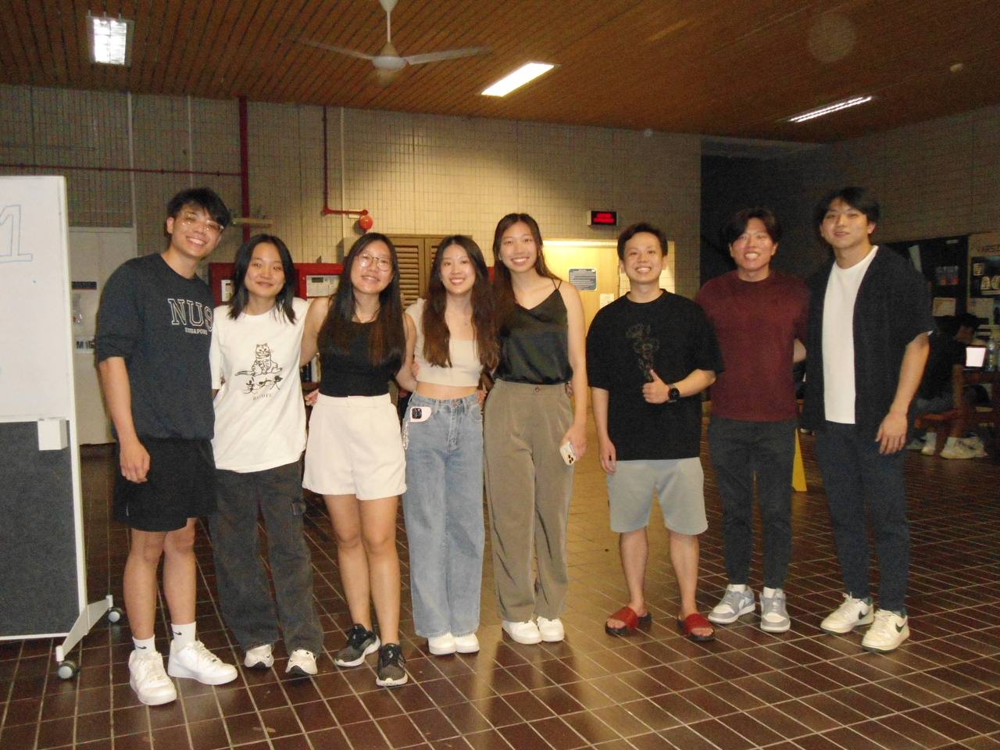

# DSA3101- Data Dynamos
👋 Hello! This is the repo for our group's application stack. It is a RESTful API that provides endpoints for the React frontend to interact with the backend. The backend is built using Flask, a Python web framework. The database used is the neo4j database.

## Prerequisites
The entire application stack runs on docker, so make sure you have Docker installed.

## Getting Started
1. git clone the repository
2. Open Docker Desktop
3. Navigate to project directory
4. ```docker-compose build --no-cache ```
5. ```docker-compose up -d```

Once all containers are running the frontend app should now be accessible on ```http://localhost:3000/ ```.

To find out more about how to operate the application, you can check out our user guide. *insert url here*

## Log-in Credentials
- Username: data dynamos
- Password: DSA3101isdabest

## Project Wiki 
Click [here](https://docs.google.com/document/d/1Ycp31-AqMMDviPTfsXyERASnIZs86TAdnKsJgl_O95M/edit?tab=t.0) to access our project wiki!

## Demo for recommendation system
Here you can download [our demo video](images_demo_video/demo_for_recommendation_system.mp4) for our recommendation system!

## Sample inputs for query page
- Tell me about Staff Marin Sergio Hernandez
- Give me a list of modules under the faculty of Dentistry
- Tell me about the Module DSA3101
- Tell me the modules that are taught by Marin Sergio Hernandez?
- What skills are required for a data analyst?
- How many students are there in the Faculty of Science?
- How many students are there in the Computer Science Major?

## Project Folder Structure
```plaintext
.
├── README.md
├── /backend
│    ├── /data
│    │    ├── 00 - mock_student_data                 # synethetic data for student details               
│    │    ├── 01 - mock_module_info                  # scraped data from NUSmods for module details
│    │    ├── 02 - mock_department_list              # scraped data from NUSmods for department details    
│    │    ├── 03 - mock_staff_info                   # synethetic data for staff details    
│    │    ├── 04 - mock_module_reviews               # scraped data from NUSmods for module reviews details    
│    │    ├── 05 - nus_undergraduate_programs        # scraped data for nus undergraduate programs details    
│    │    ├── 06 - Jobs and relevant skillset (linkedin)   # scraped data from linkedin for jobs and their relevant skillsets
│    │    ├── 07 - jobs_and_tech (ONET)              # scraped data from ONET for jobs and tech required    
│    │    ├── 08 - jobs_and_skills (ONET)            # scraped data from ONET for jobs and skills required    
│    │    └── 09 - Graduate Employment Survey        # scraped data for graduate employement survey details    
|    └── /src
│         ├── /main_functions
│         │    ├── job_recommendations.py            # functions to run recommendation system in webapp  
│         │    ├── job_skills.py                     # functions to create/delete job and skill nodes in neo4j database
│         │    ├── modules.py                        # functions to create/modify/delete modules nodes in neo4j database
│         │    ├── relevancy_scorer                  # functions to generate relevancy score for job recommendation system
│         │    ├── staffs.py                         # functions to create/modify/delete staff nodes in neo4j database
│         │    └── students.py                       # functions to create/modify/delete student nodes in neo4j database
│         ├── app.py                                 # flask app
│         ├── checking_functions.py                  # functions to run checking consistency algorithms in neo4j database
│         ├── DockerFile                             # Dockerfile for building flask container
│         ├── extraction_functions.py                # functions to extract entity types and relationships from data
│         ├── ontology_config.json                   # ontology to create neo4j database
│         ├── requirements.txt                       # dependencies for backend
│         └── utils.py                               # utility functions
│    
├── /entity_extraction
├── /frontend
│    ├── /src
│    │    ├── /dashboard-componenets                 # components required for dashboard page
│    │    │    ├── background.jpg                                   
│    │    │    ├── StudentDistributionFaculty.jsx    # student_distribution by faculties graph component
│    │    │    └── StudentDistributionMajor.jsx      # student_distribution by majors graph component
│    │    ├── /pages
│    │    │    ├── Dashboard.jsx                     # dashboard page
│    │    │    ├── Jobs.jsx                          # jobs page
│    │    │    ├── Login.jsx                         # login page
│    │    │    ├── Modules.jsx                       # modules page
│    │    │    ├── Query.jsx                         # query page
│    │    │    ├── Staffs.jsx                        # staff page
│    │    │    └── Students.jsx                      # student page
│    │    ├── App.css                                # styling for app
│    │    ├── App.js                                 # frontend for app 
│    │    ├── Home.js
│    │    ├── index.css
│    │    ├── index.js
│    │    ├── logo.svg
│    │    └── reportWebVitals.js
│    ├── public
│    ├── .dockerignore
│    ├── .gitignore
│    ├── Dockerfile                                  # Dockerfile for building react frontend container
│    ├── package.json
│    └── package-lock.json
├── .gitignore
├── .dockerignore
├── docker-compose.yml                               # docker-compose file for deploying the backend and frontend
├── package.json
└── package-lock.json
```

## Data Dictionary (Entities and Relationships in database)
```plaintext
{   
    "entities": {
        "Module": {
            "attributes": ["moduleCode", "title", "description", "moduleCredit"],
            "unique": ["moduleCode"]
        },
        "Department": {
            "attributes": ["name"],
            "unique": ["name"]
        },
        "Faculty": {
            "attributes": ["name"],
            "unique": ["name"]
        },
        "Student": {
            "attributes": ["Student_Name","Matric_Number","NRIC","Year","Faculties","Major","Second_Major","Grades"],
            "unique": ["Matric_Number"]
        },
        "Semester": {
            "attributes":["number"],
            "unique":["number"]
        },
        "Skill": {
            "attributes":["name"],
            "unique":["name"]
        },
        "Major": {
            "attributes":["name"],
            "unique":["name"]
        },
        "Staff": {
            "attributes":["Employee_Name","Employee_ID","NRIC","DOB","DOJ"],
            "unique":["Employee_Name"]
        },
        "Job": {
            "attributes":["name"],
            "unique":["name"]
        },
        "PreclusionGroup": {
            "attributes":["name"],
            "unique":["name"]
        },
        "PrerequisiteGroup": {
            "attributes":["name"],
            "unique":["name"]
        },
        "University": {
            "attributes":["name"],
            "unique":["name"]
        },
        "Degree": {
            "attributes":["degree","year","university","employment_rate_overall","basic_monthly_mean","basic_monthly_median","gross_monthly_mean","gross_monthly_median","gross_mthly_25_percentile","gross_mthly_75_percentile"],
            "unique":["degree"]
        }
    },
    "relationships": {
        "BELONGS_TO": {
            "from": "Module",
            "to": "Department"
        },
        "STUDYING_UNDER": {
            "from": "Student",
            "to": "Faculty"
        },
        "MAJOR_IN": {
            "from": "Student",
            "to": "Major"
        },
        "SECOND_MAJOR_IN": {
            "from": "Student",
            "to": "Major",
            "optional": true
        },
        "COMPLETED": {
            "from": "Student",
            "to": "Module",
            "optional": true
        },
        "OFFERED_IN": {
            "from": "Module",
            "to": "Semester"
        },
        "EMPLOYED_UNDER": {
            "from": "Staff",
            "to": "Department"
        },
        "TAUGHT_BY": {
            "from": "Module",
            "to": "Staff",
            "optional": true
        },
        "PART_OF": {
            "from": "Department",
            "to": "Faculty"
        },
        "REQUIRES": {
            "from": "Job",
            "to": "Skill",
            "optional": true
        },
        "SKILL_TAUGHT": {
            "from": "Module",
            "to": "Skill",
            "optional": true
        },
        "INCLUDED_AS_PRECLUSION": {
            "from": "Module",
            "to": "PreclusionGroup",
            "optional": true
        },
        "INCLUDED_AS_PREREQUISITE": {
            "from": "Module",
            "to": "PrerequisiteGroup",
            "optional": true
        },
        "MUST_HAVE_TAKEN_ONE_OF": {
            "from": "Module",
            "to": "PrerequisiteGroup",
            "optional": true
        },
        "MUST_NOT_HAVE_TAKEN_ONE_OF": {
            "from": "Module",
            "to": "PreclusionGroup",
            "optional": true
        },
        "OFFERS": {
            "from": "University",
            "to": "Degree"
        },
        "IS_UNDER": {
            "from": "Major",
            "to": "Degree"
        }
    },
    "representative_entities": [
        "Module",
        "Student",
        "Staff",
        "Degree"
    ]
}
```

## Contributors & TA 
