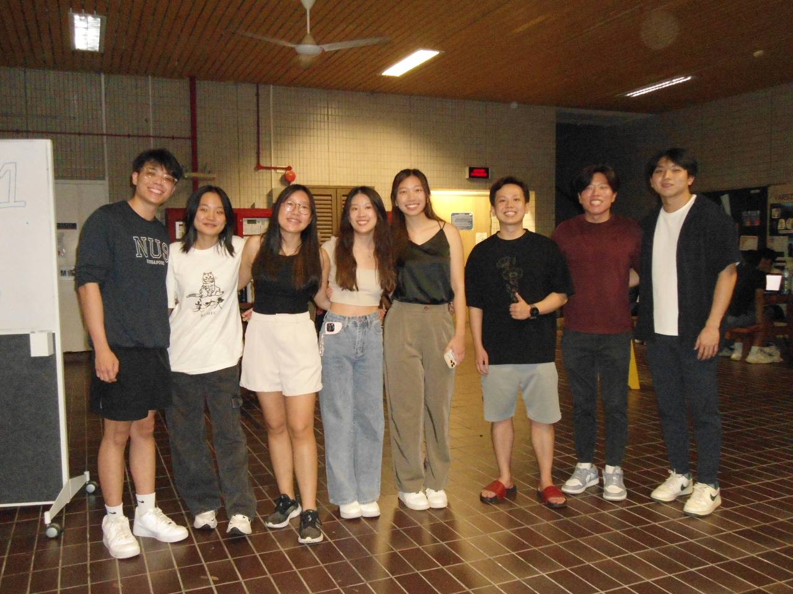

# DSA3101- Data Dynamos
👋 Hello! This is the repo for our group's application stack. 

## Prerequisites
The entire application stack runs on docker, so make sure you have Docker installed.

## Getting Started
1. git clone the repository
2. Open Docker Desktop
3. Navigate to project directory
4. ```docker-compose up --build ```

Once all containers are running the frontend app should now be accessible on ```http://localhost:3000/ ```.

To find out more about how to operate the application, you can check out our user guide. *insert url here*

## Log-in Credentials
- Username: data dynamos
- Password: DSA3101isdabest

## Project Wiki 
Click [here](https://docs.google.com/document/d/1Ycp31-AqMMDviPTfsXyERASnIZs86TAdnKsJgl_O95M/edit?tab=t.0) to access our project wiki! 

## Project Folder Structure
```plaintext
.
├── README.md
├── /backend
│    ├── /data
│    │    ├── 00 - mock_student_data                                            
│    │    ├── 01 - mock_module_info
│    │    ├── 02 - mock_department_list
│    │    ├── 03 - mock_staff_info
│    │    ├── 04 - mock_module_reviews
│    │    ├── 05 - nus_undergraduate_programs
│    │    ├── 06 - Jobs and relevant skillset (linkedin)
│    │    ├── 07 - jobs_and_tech (ONET)
│    │    ├── 08 - jobs_and_skills (ONET)
│    │    └── 09 - Graduate Employment Survey
|    ├── /src
│    │    ├── /main_functions
│    │    │    ├── job_recommendations.py
│    │    │    ├── job_skills.py
│    │    │    ├── modules.py
│    │    │    ├── relevancy_scorer
│    │    │    ├── staffs.py
│    │    │    └── students.py
│    │    ├── app.py
│    │    ├── checking_functions.py
│    │    ├── DockerFile
│    │    ├── extraction_functions.py
│    │    ├── ontology_config.json
│    │    ├── requirements.txt
│    │    └── utils.py
│    └── test.py
├── /entity_extraction
├── /frontend
│    ├── /src
│    │    ├── /dashboard-componenets
│    │    │    ├── background.jpg 
│    │    │    ├── StudentDistributionFaculty.jsx
│    │    │    └── StudentDistributionMajor.jsx
│    │    ├── /pages
│    │    │    ├── Dashboard.jsx
│    │    │    ├── Jobs.jsx
│    │    │    ├── Login.jsx
│    │    │    ├── Modules.jsx
│    │    │    ├── Query.jsx
│    │    │    ├── Staffs.jsx
│    │    │    └── Students.jsx
│    │    ├── App.css
│    │    ├── App.js
│    │    ├── Home.js
│    │    ├── index.css
│    │    ├── index.js
│    │    ├── logo.svg
│    │    └── reportWebVitals.js
│    ├── public
│    ├── .dockerignore
│    ├── .gitignore
│    ├── Dockerfile
│    ├── package.json
│    └── package-lock.json
├── .gitignore
├── .dockerignore
├── docker-compose.yml
├── package.json
└── package-lock.json
```

## Contributors & TA 
